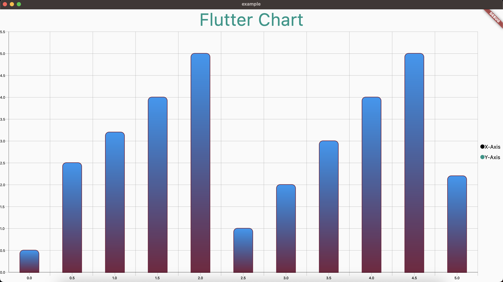

<!--
This README describes the package. If you publish this package to pub.dev,
this README's contents appear on the landing page for your package.

For information about how to write a good package README, see the guide for
[writing package pages](https://dart.dev/guides/libraries/writing-package-pages).

For general information about developing packages, see the Dart guide for
[creating packages](https://dart.dev/guides/libraries/create-library-packages)
and the Flutter guide for
[developing packages and plugins](https://flutter.dev/developing-packages).
-->

# Charts

Charts are visual representations of data that help to present information in a clear and organized manner. They are graphical tools used to illustrate and communicate complex data sets, trends, and relationships. Charts are commonly used in various fields, including business, finance, statistics, and academia, to analyze data and convey information effectively.


## Getting started

Run this command

```
$flutter pub add geekyants_flutter_charts
```

This will add a line like this to your package's pubspec.yaml (and run an implicit flutter pub get):

```dart
dependencies:
  geekyants_flutter_charts: 1.0.0
```

## Usage

Import it inside your main.dart

```dart
import 'package:geekyants_flutter_charts/geekyants_flutter_charts';
```

Use it as below

```dart
class _MyChartExampleState extends State<MyChartExample> {
  @override
  Widget build(BuildContext context) {
    return Scaffold(
      body: BarChart()
    );
  }
}
```

## Customization

The `BarChart` widget supports various customization options. Here are some examples:

## Bar Chart Title
You can customize the legends displayed in the bar chart using the `BarChartLegends` class:

```dart
  BarChartTextTitle(
    text: 'Flutter Chart',
    textStyle: TextStyle(fontSize: 50, color: Colors.teal)),
```
## Bar Chart Legends
You can customize the legends displayed in the bar chart using the `BarChartLegends` class:

```dart
BarChartLegends(
  legendTextXAxis: 'X-Axis',
  legendTextYAxis: 'Y-Axis',
  legendTextXAxisStyle: TextStyle(color: Colors.black, fontSize: 15),
  legendTextYAxisStyle: TextStyle(color: Colors.black, fontSize: 15),
  legendXAxisColor: Colors.black,
  legendYAxisColor: Colors.black,
  legendPointerRadius: 6,
)
```
## Bar Chart Axis
You can customize the axis of the bar chart using the `BarChartAxis` class:
```dart
BarChartAxis(
  xAxisLabelTextStyle: TextStyle(fontSize: 12, color: Colors.black),
  yAxisLabelTextStyle: TextStyle(fontSize: 12, color: Colors.black),
  xAxisRulerThickness: 2.0,
  xAxisRulerHeight: 135,
  yAxisRulerHeight: 200,
  yAxisRulerThickness: 1.0,
  xAxisRulerColor: Colors.deepOrangeAccent,
  yAxisRulerColor: Colors.purpleAccent,
  xAxisMainThickness: 5,
  yAxisMainThickness: 5,
  xAxisMainColor: Colors.deepPurpleAccent,
  yAxisMainColor: Colors.deepOrangeAccent,
  xAxisMainStrokeType: StrokeCap.square,
  yAxisMainStrokeType: StrokeCap.butt,
  xAxisStartPoint: 0,
  xAxisEndPoint: 5.5,
  xAxisIntervalRange: 0.5,
  yAxisStartPoint: 0,
  yAxisEndPoint: 100,
  xAxisSteps: 90,
  yAxisSteps: 90,
  xAxisRulerOffset: 200,
  xAxisLabelOffset: 80,
  yAxisRulerOffset: 100,
  yAxisLabelOffset: 50,
  xAxisGridRulerThickness: 2.0,
  yAxisGridRulerThickness: 1.0,
  xAxisGridRulerColor: Colors.purple,
  yAxisGridRulerColor: Colors.orange,
  showXAxisGridRuler: false,
  showYAxisGridRuler: false,
)
```

## Vertical Bar Chart
You can customize the way of showing your data with vertical bar chart representation:

```dart
BarChartAxis(
  verticalBarColor: Colors.orange,
  showGradientBars: true,
  yAxisData: [0.5, 2.5, 3.2, 4.0, 5.0, 1.0, 2.0, 3.0, 4.0, 5.0, 2.2],
  verticalBarBorderColor: Color.fromARGB(255, 115, 29, 58),
  verticalBarBorderRadius: 10.0,
  verticalBarBorderWidth: 3.0,
  verticalBarGradientShader: LinearGradient(
    colors: [Colors.blue, Color.fromARGB(255, 119, 36, 64)],
    begin: Alignment.topCenter,
    end: Alignment.bottomCenter,
  ),
)
```

## Demo Shots

 

 

 


## License

[MIT License](LICENSE) , Copyright © 2023 GeekyAnts. See LICENSE for more information.

## Contributors

<a href="https://github.com/GeekyAnts/geekyants_flutter_charts/graphs/contributors">
  
</a>

## Credits

Made with ❤️ by <a href="https://geekyants.com/" ></a>

<b>Warning: This is an alpha release. The package is under active development, and there might be breaking changes in future updates. Please use with caution and be prepared to update your code accordingly.</b>